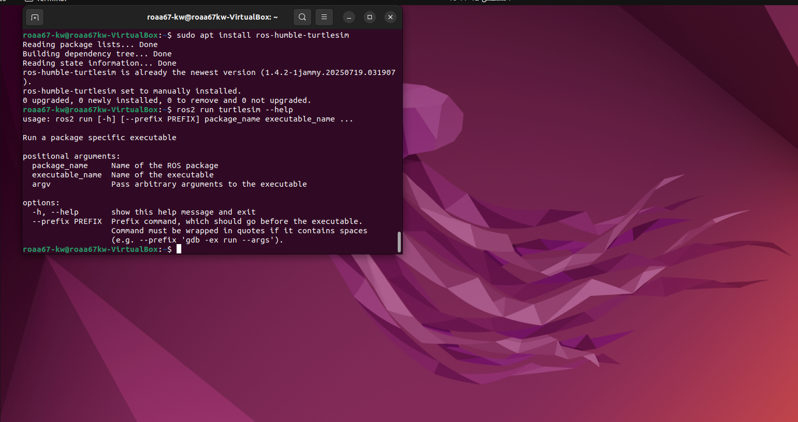
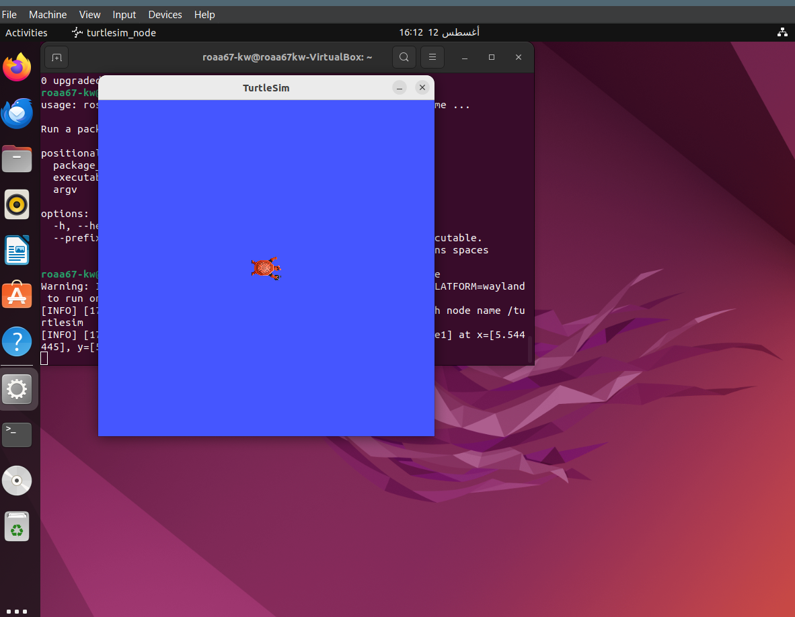
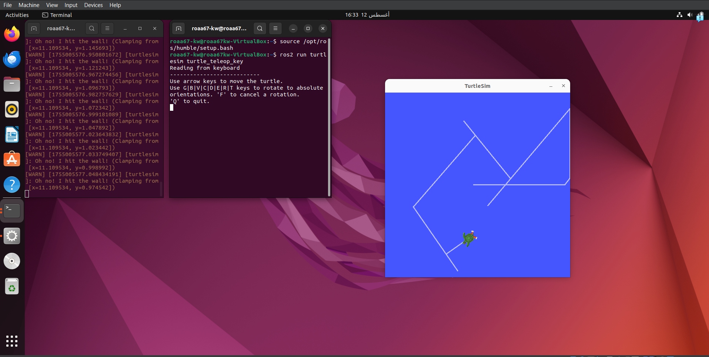
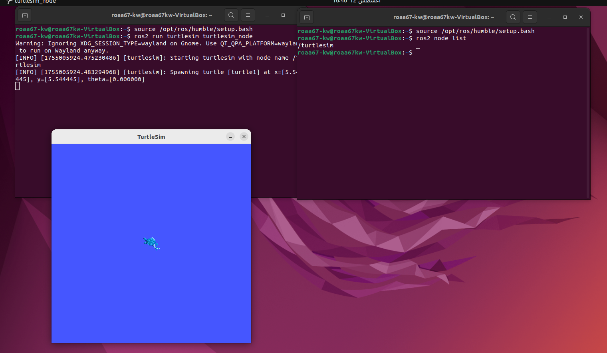
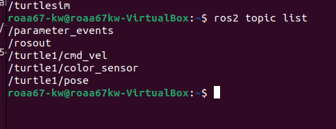
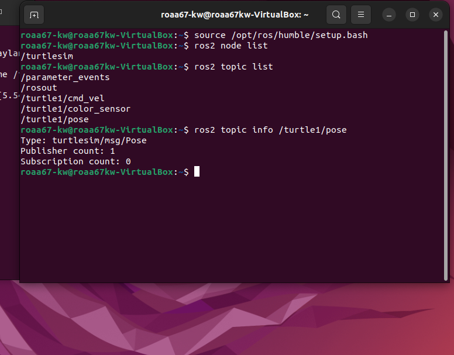

# ROS2-TurtleSim-Your-First-Dive-into-Robotics

This document is a quick guide to installing and running the `turtlesim` package using ROS2 Humble. The goal is to understand ROS2 basics like **Nodes** and **Topics** through a hands-on example.

---

## Prerequisites

*   **Ubuntu 22.04** operating system.
*   **ROS2 Humble** installed on your system.

---

## Execution Steps

Follow these steps in order to run the simulation.

### 1. Install ROS2 Humble

If you don't have ROS2 installed, follow the official instructions from the link below:
- **[ROS2 Humble Installation Link](https://docs.ros.org/en/humble/Installation/Ubuntu-Install-Debians.html )**

After installation, make sure to source the ROS2 environment in every new terminal you use with the command:
```bash
source /opt/ros/humble/setup.bash
```
### 2. Install the TurtleSim Package

Install the turtlesim package using the apt package manager:
```bash
sudo apt install ros-humble-turtlesim
```
Once installed, you can verify the package by running:
```bash
ros2 run turtlesim --help
```



### 3. Run the Simulation
To launch the turtle window, open a new terminal and run the following node:
```bash
ros2 run turtlesim turtlesim_node
```
A new window with a turtle will appear. Keep this window open.




### 4. Control the Turtle
To move the turtle, open a second terminal and run the control node:
```Bash
ros2 run turtlesim turtle_teleop_key
```
Now, use the arrow keys on your keyboard (↑ ↓ ← →) to move the turtle in the first window.


---
## Inspecting the ROS2 System

#### To see which nodes are currently active in the ROS2 system, run the following command:

```bash
ros2 node list
```


#### To view all active topics used by the running nodes, use the following command:

```bash
ros2 topic list
```
This displays a list of topics used for communication between nodes.




#### To view detailed information about a specific topic, like its message type and how many nodes are connected to it, use:

```bash
ros2 topic info /turtle1/pose
```

